<!-- ===========================================================
                            PRESENTACIÓN 
     =========================================================== -->

   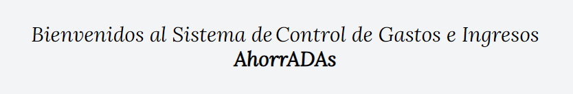

***

   

***

 ## Tabla de Contenidos:
 
- [AhorrADAs](#ahorradas)
- [Tecnologías](#tecnologías)
- [Construcción](#construcción)
- [Menús](#menus)
- [Footer] (#footer)
- [Mobile](#mobile)
- [Contáctanos](#contáctanos)

---
 

<!-- ==================================================
                         CONTENIDO 
     ================================================== -->

## *AhorrADAs*

[:top:](#tabla-de-contenidos)  

Las aplicaciones web, comúnmente conocidas como apps, se han convertido en una parte esencial de nuestra vida cotidiana. Desde simplificar tareas diarias hasta ofrecer entretenimiento.  
La app `AhorrADAs` es una app web, que permite que cualquier usuario pueda realizar registro de operaciones personales o de una PYME, y de esta manera pasar de un proceso manual a uno digital, lo que conlleva un gran ahorro de tiempo. Además, esto simplifica el trabajo y genera una reducción en el costo de las rendiciones de gastos. 
Por medio de la app `AhorrADAs` el usuario accede de forma sencilla a reportes e información de gastos, ganancias y sus balances.
Por su simple interfaz, `AhorrADAs` es una potente herramienta que ayuda a simplificar el control de las rendiciones, a llevar un exhaustivo control gastos y ganancias, y así evitar realizar operaciones innecesarias, que llevarían a un déficit personal o empresarial. 

La app `AhorrADAs`, fue diseñada de tal manera que puede ser utilizada en diferentes dispositivos, lo que implica un correcto diseño responsive. 

( FALTA imagen )

   

 

Fue desarrollado como Trabajo Final del "Módulo 3 - JavaScript", de la capacitación de `"Desarrollo Frontend"` dictado por [ADA ITW](https://www.linkedin.com/school/ada-itw/), y se encuentra incluido en nuestros `Portfolios`, de tal manera de reflejar el grado de avance, apropiación y uso de los conocimiento adquiridos y asimilados durante la capacitación.

> [!NOTE]
> Visite nuestros portafolios: [PORTFOLIO MAGUI](https://maguibrollo.github.io/ADA_Portafolio_mod01_tf/)  -  [PORTFOLIO LUCÍA](https://lucbea.github.io/Portafolio-Frontend/).

 

## *Tecnologías*
[:top:](#tabla-de-contenidos)  
La app AhorrADAs fue desarrollada utilizando las siguientes tecnologías:  

|   |   |  |
| :---: | :---: | :---: |
|Lenguaje de marcado de hipertexto. Consiste en marcas basado en etiquetas que otorgan la estructura básica de la app.| Tailwind es un framework de CSS que tiene Utility Classes, que son clases específicas para estilo. | Lenguaje de programación. Otorga interactividad a las distintas secciones que conforman la app.|

 

## *Construcción*
[:top:](#tabla-de-contenidos)  
AhorrADAs, presenta una pantalla principal de bienvenida. Permite navegar por los diferentes menús utilizando teclado, mouse o táctil, en el caso de dispositivos móviles. Los menús disponibles son: [Inicio](#inicio), [Balance](#balance), [Categorías](#categorías), [Reportes](#reportes).  
Además, dispone del botón `Modo claro` / `Modo Oscuro` que permite intercambiar entre los dos modos de visualización. La visualización se realiza por defecto en el Modo que se tenga seleccionado como tema en el sistema operativo, pero puede cambiar entre `Modo Claro` y `Modo Oscuro` y este cambio permanecerá.

 

|MODO CLARO| MODO OSCURO |
|    :---:  |   :---:  |
|| 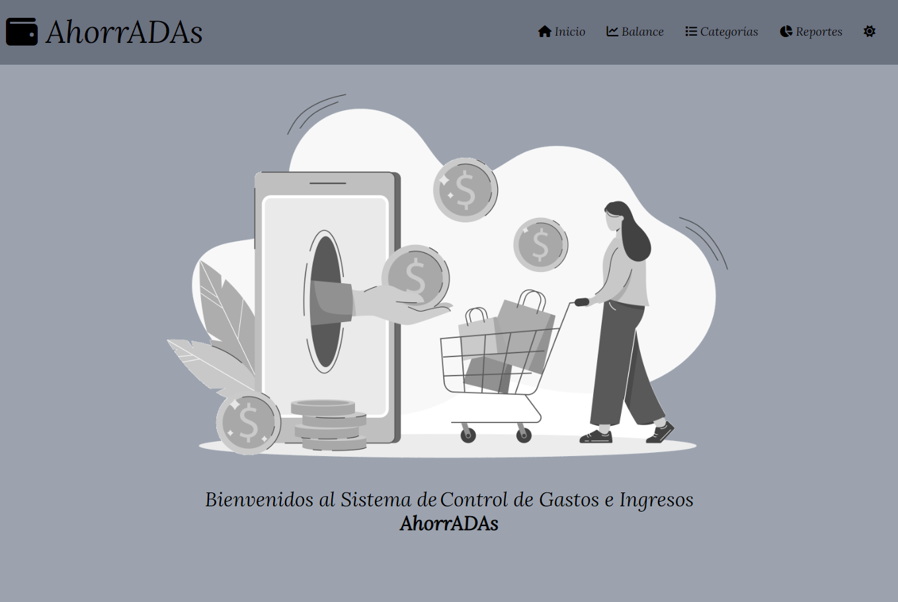|

---

## *Menús*
[:top:](#tabla-de-contenidos)  

- [Inicio](#inicio)
- [Balance](#balance)
- [Operaciones](#operaciones)
- [Categorías](#categorías)
- [Reportes](#reportes)

---

#### Inicio
[:top:](#menús)  
Da la bienvenida a la aplicación.  

   

---

#### Balance
[:top:](#menús)
El menú `Balance`, presenta tres secciones: Balance, Filtros y Operaciones.

(.....  imagen ..........)

   

Secciones:
- **Balance**: Permite conocer el total de Ganancias, el total de Gastos y el Total del balance, positivo o negativo, de las operaciones visibles, que dependen de lo que se ha seleccionado en la sección "Filtros". 

- **Filtros**: Puede seleccionar entre las siguientes opciones: 
 Mostrar/Ocultar Flitros: muestra u oculta los filtros, para mayor disponibilidad de espacio, en especial en móviles.  
TIPO: seleccionar el tipo de operación "Gastos" o "Ganancias". 
CATEGORÍAS: seleccionar una categoría en especial, o seleccionar todas las categorías. 
FECHA DESDE: seleccionar a partir de qué fecha se desea visualizar las operaciones. 
FECHA HASTA: seleccionar hasta qué fecha se desea visualizar las operaciones. 
ORDENAR POR: seleccionar el orden de visualización, por fecha, por monto o por descripción. 
 

Al ingresar a la sección Balance y Filtros aparece un mensaje momentáneo que le recuerda al usuario que puede mofificar los filtros para que se visualicen distintos grupos de operaciones registradas en la tabla de Operaciones.
Este mensaje posee movimiento a fin de captar la atención del usuario del sistema. Luego de 5 segundos el mensaje se oculta.

   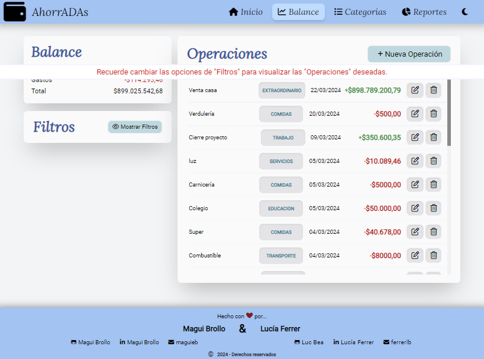

---

#### Operaciones
[:top:](#menús)

   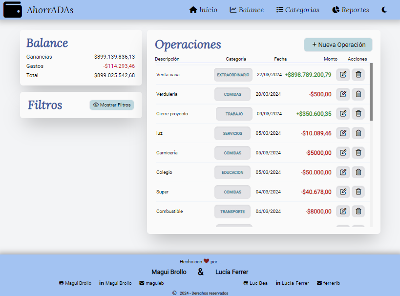

 Esta sección permite:
   - Ingreso de nuevas operaciones.  
   - Conocer las operaciones que se han registrado.  
   - Modificar los datos que contienen las operaciones registradas.  
   - Proceder a eliminar operaciones guardadas.  
   Para el ingreso de nuevas operaciones, el sistema AhorrADAS presenta las siguientes funcionalidades
      - Se permite el ingreso de descripciones hasta 25 caracteres.
      - El ingreso de los montos permite sumas considerables del orden de la centena de millón.
      - Los valores decimales se redondean al orden de la centésima.
      - Para mejor legibilidad se destacan en diferentes colores los montos que corresponden a ingresos -verdes- de aquellos relacionados con egresos -rojos-.
      - El dato de la categoría asociada se encuentra destacado, de tal manera de proporcionar información sobre el tipo de ingreso o gasto. Hay relación entre las modificaciones que puedan producirse en el nombre de la categoría, apreciándose en este listado de manera automática.
      - Las fechas se visualizan con el formato dd/mm/aaaa, que es el que se utiliza en la región.
      - En formato ordenador, la barra de desplazamiento verical anexada a la tabla de operaciones permite una mejor interpretación de los datos registrados debido a que en todo momento aparece el encabezado que aporta información del tipo de dato que se muestra.

   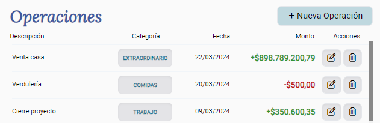

 

   También, para el ingreso de nuevas operaciones, el sistema AhorrADAS presenta los siguientes controles:

   - En caso de que el tipo de operación, la fecha y la categoría de la misma no sean ingresadas se tomarán los valores por defecto para cada uno de esos datos.
   - Necesidad de ingreso de descripción para una nueva operación.
   - Solicitud de que el monto sea positivo, que luego podrá discriminarse como ganancia o gasto. No se permite el ingreso de montos menores o iguales a cero.

   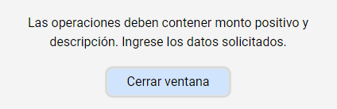

 

   Para el proceso de edición de una operación ya registrada, el sistema AhorrADAS presenta las mismas funcionalidades y controles que han sido descriptos en el apartado anterior en relación al ingreso de una nueva operación.

   En el momento de optar por la eliminación de una operación registrada, el sistema AhorrADAS permite la revisión de la decisión solicitada a través de un mensaje de control, que le indica al usuario que confirme o anule la solicitud de borrado de la operación.

   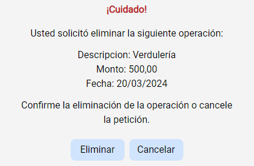

 
 

> [!NOTE]
> Si se minimiza el tamaño de la ventana, horizontalmente, la sección `Operaciones` se visualizará en la parte inferior (ver [Mobile](#mobile)).

   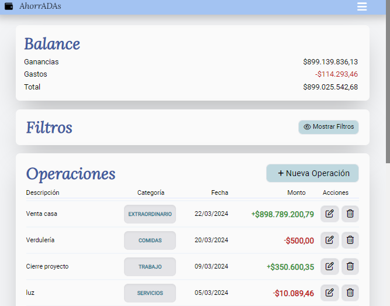

 

---

#### Categorías
[:top:](#menús)

   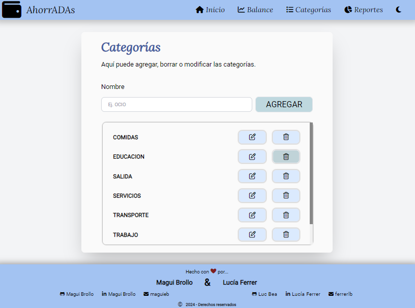

 Esta sección permite:

   - Ingreso de nuevas categorías.  
   - Conocer las categoríass que se han registrado, mediante el listado de las mismas.  
   - Modificar el nombre de la categoría registrada.  
   - Eliminar categorías guardadas.  

Para el ingreso de nuevas categorías, el sistema AhorrADAS presenta las siguientes funcionalidades:
   - Se exige el ingreso de nombre -que pueden ser frases- hasta 14 caracteres.
   - En formato ordenador, la barra de desplazamiento verical anexada a la tabla de categorías permite una rápida búsqueda de las categorías registradas sin tener que prescindir del lugar de ingreso de la nueva categoría, lo que aporta practicidad en el momento del nuevo registro, evitando duplicaciones.
 

Tanto para el ingreso de nueva categoría como para la edición de alguna de las ya registradas, el sistema AhorrADAS presenta los siguientes controles:

   - Imposibilidad de anexar categoría sin nombre.
   - Imposibilidad de registrar categorías duplicadas.
      

   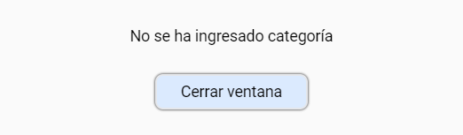
   

Además, toda modificación del nombre de la categoría impacta automáticamente en el listado de operaciones donde se muestra la categoría actualizada en tiempo real.

 

En cuanto a la eliminación de alguna categoría registrada, este sistema presenta los siguientes controles:
   - Imposibilidad de eliminar categorías que tengan operaciones asociadas. El sistema solicita se eliminen previamente las operaciones relacionadas con la categoría a eliminar.
   - Aquellas categorías que no cuenten con operaciones asociadas y se desean eliminar tienen un paso de revisión de la decisión solicitada a través de un mensaje de control, que le indica al usuario que confirme o anule la solicitud de borrado de la categoría.
            

   
   

 

---

#### Reportes
[:top:](#menús)

   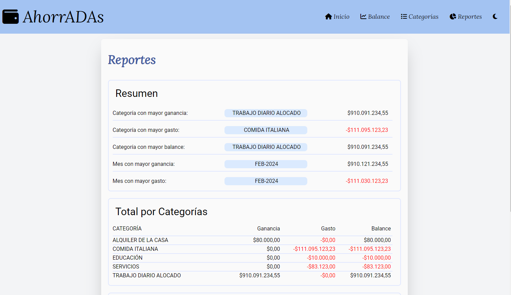

El menú reportes organiza los datos de las operaciones, para mostrar toda la información relevante en forma resumida. Las secciones son `Resumen`, `Total por Categorías` y `Total por Mes`. La organización y detalle de este reporte permite conocer los gastos, ganancias y balances por tipo de operación, por categoría o por mes. Cada sección presenta la información justa y resumida, que le permitirá a todo usuario conocer sus movimientos y de esta manera tomar decisiones sobre como continuar con sus operaciones. 

   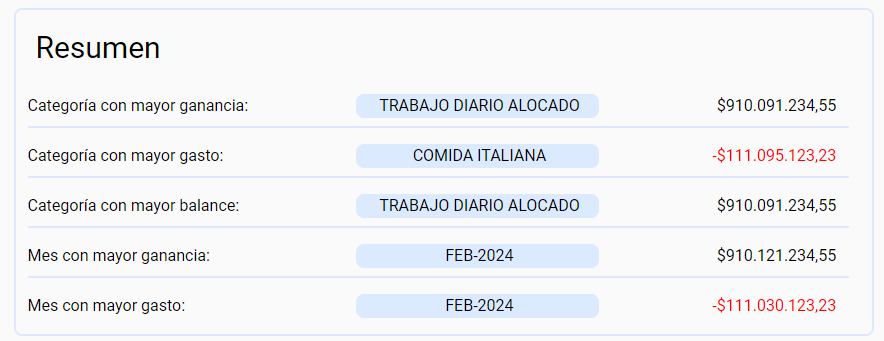

   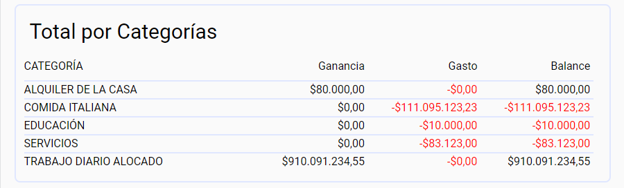

   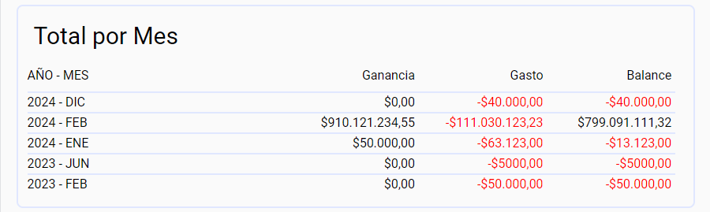

---
## *Footer:*
[:top:](#tabla-de-contenidos)  
En el footer se encuentran las referencias de las creadoras de este contenido, nombres y contactos.
En el formato ordenador, el footer tiene la posibilidad de contraerse o expandirse.

   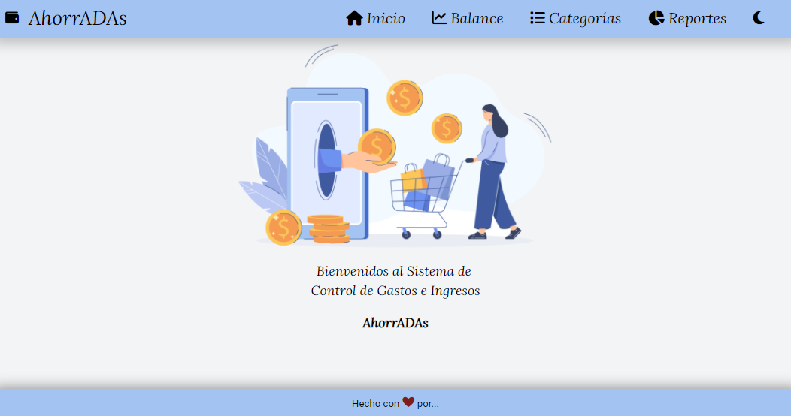
   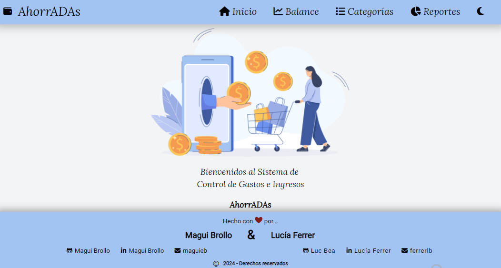

 

---
## *Mobile:*
[:top:](#tabla-de-contenidos)  
Todas los menús explicados anteriormente, se encuentran disponibles para dispositivos móviles:

|Modo Oscuro| Modo Claro|
|:---:|:---:|
|||

 

|Menú | Menú |
|:---:|:---:|
|||

 

|Pantalla Horizontal| 
|:---:|
||

| Edición Horizontal|
|:---:|
||

 

---

## *Contáctanos:*
[:top:](#tabla-de-contenidos)  

--- 